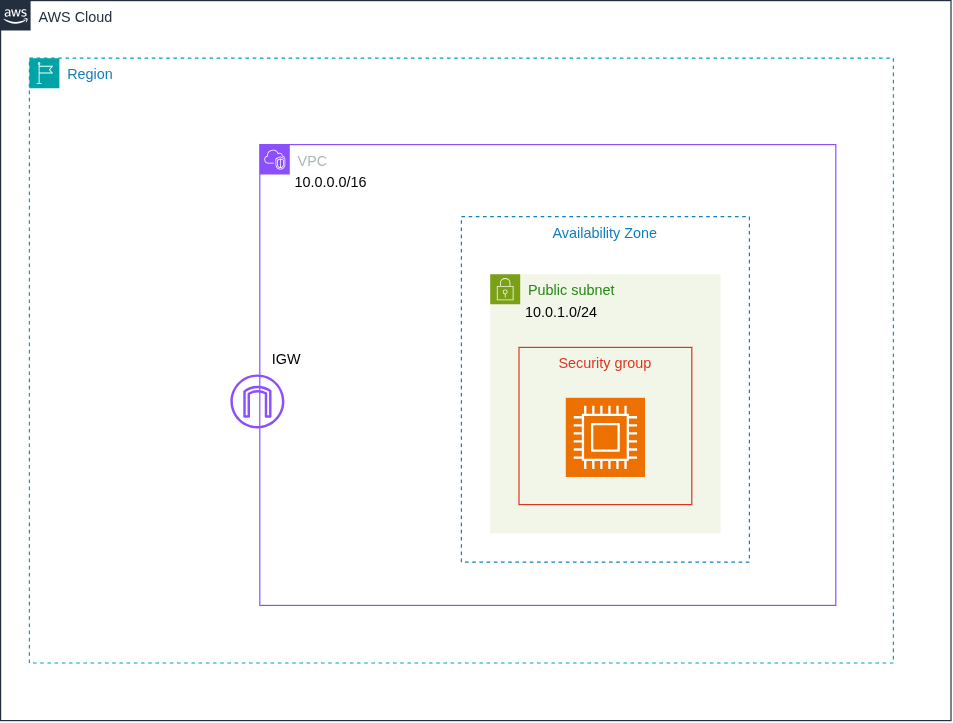
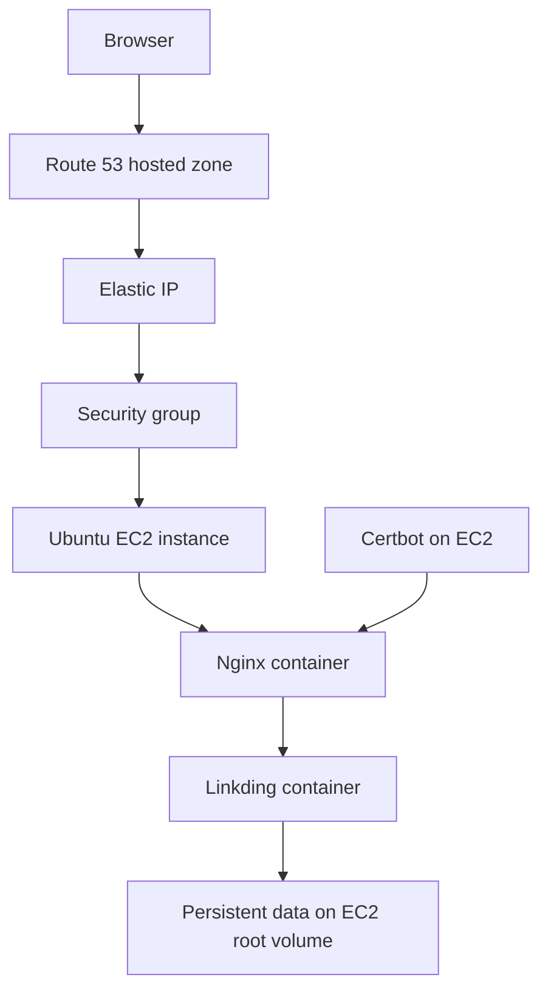

# Linkding on AWS

Terraform infrastructure for deploying a self-hosted [Linkding](https://github.com/sissbruecker/linkding) bookmark manager on AWS. The project provisions an EC2 instance and its network resources, publishes the application through Route 53, and bootstraps a Docker Compose stack with Nginx and Let's Encrypt TLS.



## Architecture



Terraform creates:

- One VPC with a public subnet, internet gateway, and default internet route.
- A security group allowing inbound SSH, HTTP, and HTTPS traffic.
- An encrypted EC2 instance with IMDSv2 enforced.
- An Elastic IP attached to the instance.
- A Route 53 public hosted zone and an apex `A` record.
- An S3-backed Terraform state configuration with native lockfile support.

The EC2 user-data script then:

1. Installs Docker Engine, Docker Compose, Certbot, and supporting packages.
2. Starts Linkding and Nginx containers.
3. Requests a Let's Encrypt certificate.
4. Redirects HTTP traffic to HTTPS and enables automatic certificate renewal.
5. Creates an `admin` user with a generated password.

## Current configuration

The repository is currently configured with these values:

| Setting | Value | File |
| --- | --- | --- |
| AWS region | `ap-southeast-1` | `provider.tf` |
| Instance type | `t3.micro` | `main.tf` |
| AMI | `ami-0532913178263be11` | `main.tf` |
| EC2 key pair | `universal-key` | `main.tf` |
| Domain | `rezedev.site` | `main.tf`, `output.tf`, `scripts/linkding-bootstrap.sh` |
| Terraform state bucket | `kami-dev-tfstate` | `backend.tf` |
| Terraform state key | `dev/terraform.tfstate` | `backend.tf` |
| AWS provider | `~> 6.0` | `provider.tf` |

> [!IMPORTANT]
> These values are hard-coded rather than exposed as root Terraform variables. Review and update them before deploying to another AWS account, region, or domain. The bootstrap script supports Ubuntu only, so the selected AMI must be an Ubuntu image compatible with the selected instance type and region.

## Prerequisites

Before deploying, ensure that you have:

- [Terraform](https://developer.hashicorp.com/terraform/install) installed.
- An AWS account and credentials available to Terraform.
- Permissions to manage EC2, VPC, Elastic IP, security group, and Route 53 resources.
- An existing S3 bucket for the Terraform backend.
- An EC2 key pair in the target AWS region and its private key.
- A registered domain whose nameservers you can change.

For example, authenticate through environment variables, an AWS profile, or AWS IAM Identity Center, then verify access:

```bash
aws sts get-caller-identity
```

## Configuration

At minimum, review the following before running Terraform:

1. Update the S3 backend bucket, key, and region in `backend.tf`.
2. Set the AWS region in `provider.tf`.
3. Set a valid Ubuntu AMI ID, EC2 key-pair name, instance type, and domain in `main.tf`.
4. Replace every occurrence of `rezedev.site` in:
   - `main.tf`
   - `output.tf`
   - `scripts/linkding-bootstrap.sh`
   - `default.conf` if you use the reference Nginx configuration directly
5. If needed, restrict the SSH ingress CIDR in `modules/security-group/main.tf`. It currently permits port 22 from `0.0.0.0/0`.

The root `compose.yaml` and `default.conf` files document the resulting container setup. Runtime copies are generated directly by `scripts/linkding-bootstrap.sh`, so changes to those root files alone do not alter a newly provisioned instance.

## Deployment

Initialize Terraform and download the AWS provider:

```bash
terraform init
```

If you changed the backend configuration, use:

```bash
terraform init -reconfigure
```

Format and validate the configuration:

```bash
terraform fmt -check -recursive
terraform validate
```

Review the proposed infrastructure changes:

```bash
terraform plan -out=tfplan
```

Apply the reviewed plan:

```bash
terraform apply tfplan
```

After the apply completes, Terraform prints the instance IP, application URL, and Route 53 nameservers. You can display them again with:

```bash
terraform output
```

### Delegate the domain to Route 53

Set the values from `route53_name_servers` as the authoritative nameservers at your domain registrar. All nameservers must be copied exactly.

> [!WARNING]
> The bootstrap script retries certificate issuance for approximately 10 minutes while waiting for DNS. On the first deployment, update the registrar nameservers as soon as Terraform outputs them. Registrar delegation can take longer than the retry window; if it does, inspect the bootstrap log after DNS has propagated and rerun or recover the bootstrap process before using the site.

Check public DNS delegation with:

```bash
dig NS rezedev.site +short
dig A rezedev.site +short
```

The `A` record should resolve to the value of `instance_public_ip`. Once DNS propagation and bootstrap complete, open the value shown by `linkding_url`.

## Administrator credentials

The bootstrap creates a Linkding administrator named `admin`. Its generated password is stored only on the EC2 instance at:

```text
/root/linkding-credentials.txt
```

Connect using the private key corresponding to the configured EC2 key pair:

```bash
ssh -i /path/to/private-key.pem ubuntu@INSTANCE_PUBLIC_IP
sudo cat /root/linkding-credentials.txt
```

Replace `INSTANCE_PUBLIC_IP` with `terraform output -raw instance_public_ip`. Keep the file private and change the password after the first login.

## Operations

Application files and persistent data are stored under `/opt/linkding` on the instance:

| Path | Purpose |
| --- | --- |
| `/opt/linkding/compose.yaml` | Runtime Docker Compose configuration |
| `/opt/linkding/data` | Linkding application data |
| `/opt/linkding/nginx/default.conf` | Runtime Nginx configuration |
| `/opt/linkding/certbot/www` | ACME HTTP challenge webroot |
| `/etc/letsencrypt` | TLS certificates and renewal configuration |
| `/var/log/linkding-bootstrap.log` | Bootstrap log |

Useful commands to run over SSH include:

```bash
cd /opt/linkding
sudo docker compose ps
sudo docker compose logs --tail=100 linkding
sudo docker compose logs --tail=100 nginx
sudo docker compose pull
sudo docker compose up -d
```

Certbot renewal is managed by `certbot.timer`. A deploy hook reloads Nginx after successful renewal:

```bash
sudo systemctl status certbot.timer
sudo certbot renew --dry-run
```

### Backups

Linkding data resides on the EC2 root volume at `/opt/linkding/data`. This project does not configure automated backups or a separate persistent volume. Back up that directory before replacing or destroying the instance.

## Troubleshooting

Check whether cloud-init and the bootstrap completed:

```bash
sudo cloud-init status --long
sudo tail -n 200 /var/log/linkding-bootstrap.log
```

Common issues include:

- **Certificate request fails:** confirm the registrar uses the Route 53 nameservers and the domain resolves to the Elastic IP.
- **SSH connection fails:** confirm the correct private key is used and that local or corporate firewalls permit port 22.
- **Application returns an error:** inspect both container logs and run `sudo docker compose -f /opt/linkding/compose.yaml ps`.
- **Terraform backend initialization fails:** verify the S3 bucket exists in the configured region and the AWS identity has access to it.
- **Bootstrap rejects the operating system:** select a compatible Ubuntu AMI for the configured AWS region.

## Security and production considerations

- SSH is currently exposed to the entire internet. Restrict it to a trusted CIDR or use AWS Systems Manager Session Manager.
- Container images use mutable tags (`latest` and `stable-alpine`). Pin versions or digests for reproducible deployments.
- The generated administrator credential remains in a root-only file until manually removed.
- Linkding data is stored on the instance root volume and has no automated backup policy.
- The configuration creates public DNS, an Elastic IP, and internet-accessible services. Review AWS and Let's Encrypt costs, quotas, and limits before deployment.
- Terraform state can contain sensitive infrastructure data. Keep the backend bucket private, encrypted, and access-controlled.

## Destroying the deployment

Review the resources Terraform will remove:

```bash
terraform plan -destroy
```

Then destroy them:

```bash
terraform destroy
```

Destroying the EC2 instance also removes application data stored on its root volume. Create a backup first. The S3 backend bucket itself is not managed by this configuration and will not be deleted.

## Project structure

```text
.
├── backend.tf                    # S3 remote state configuration
├── compose.yaml                  # Reference Linkding and Nginx stack
├── default.conf                  # Reference HTTPS Nginx configuration
├── main.tf                       # Root module wiring and deployment settings
├── modules/
│   ├── dns/                      # Route 53 hosted zone and A record
│   ├── ec2/                      # EC2 instance and Elastic IP
│   ├── security-group/           # SSH, HTTP, HTTPS, and egress rules
│   └── vpc/                      # VPC, subnet, gateway, and routing
├── output.tf                     # Public IP, URL, and nameserver outputs
├── provider.tf                   # AWS provider requirements and region
└── scripts/
    └── linkding-bootstrap.sh     # Instance provisioning and app setup
```
